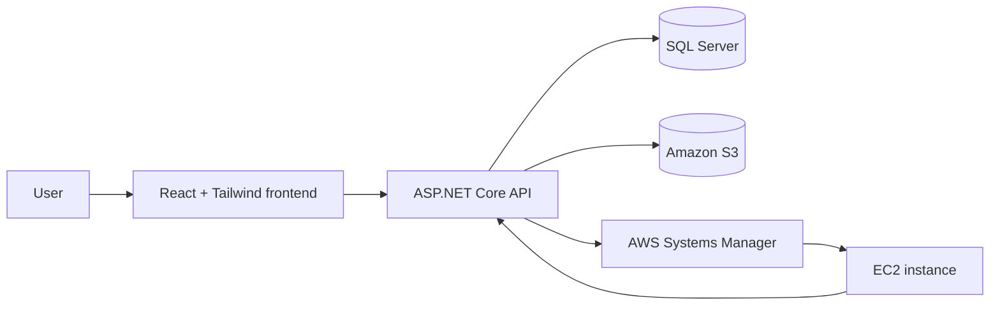
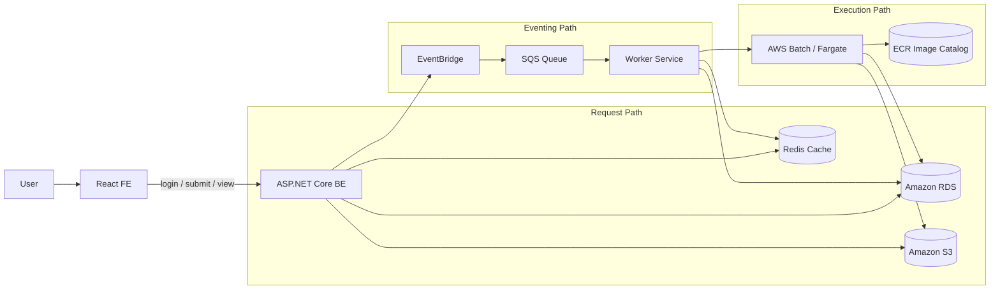

# Simplified Cloud Job Execution System

Minimal end-to-end demo for the take-home assignment: a React frontend submits cloud jobs, an ASP.NET Core backend stores metadata in SQL Server, uploads input/output files to S3, triggers a small EC2 execution step through AWS SSM, and calculates mock billing when the job is completed.

## Architecture Overview



### What each part does

- The frontend in [fe](fe) provides the submission form, job list, detail view, and manual completion flow.
- The backend in [api](api) exposes the job and billing endpoints.
- SQL Server stores job metadata and billing state.
- S3 stores input and output file references.
- AWS SSM sends a shell command to the target EC2 instance so the assignment includes a real cloud execution step.

## AWS Services Used

- Amazon S3 for input/output file storage
- AWS Systems Manager for remote command execution on EC2
- EC2 as the small execution target
- SQL Server for relational persistence of job state

## Storage Model

Uploaded files are stored in S3 using this object key structure:

```text
s3://<bucket-name>/yyyy/MM/dd/<requestHash>_<fileName>
```

Examples:

- input: `s3://simplified-cloud-job/2026/06/29/ABC123_input.csv`
- output: `s3://simplified-cloud-job/2026/06/29/ABC123_output.txt`

The backend stores the full S3 reference in `InputFileName` and `OutputFileReference`.

## Job Lifecycle

1. A user submits a job from the frontend.
2. The backend stores the input file in S3 and inserts the initial job row.
3. The backend triggers an EC2 command through SSM.
4. The EC2 command can call back into `POST /api/jobs/{id}/complete`.
5. Completion stores the output file reference and calculates credit cost.
6. Billing summary is read from completed jobs in the database.

## Setup and Run Instructions

### Prerequisites

- .NET 10 SDK
- Node.js 20+ for the frontend
- SQL Server available at `localhost,5000` or update the connection string
- AWS credentials configured locally for the profile in `appsettings.json`
- A real S3 bucket and EC2 instance if you want to exercise the AWS path

### Backend

From the `api` folder:

```bash
dotnet restore
dotnet ef database update
dotnet run
```

To start SQL Server locally with Docker, run this from any terminal:

```bash
docker run -e "ACCEPT_EULA=Y" -e "MSSQL_SA_PASSWORD=secretdbpassword123@" \
	-p 5000:1433 --name cloud-job-mssql \
	-d mcr.microsoft.com/mssql/server:2025-latest
```

Then connect with any SQL client tool to `localhost,5000` using:

- user: `sa`
- password: `secretdbpassword123@`

Create the database named `simplified-cloud-job-local`, then go to the `api` folder and run:

```bash
dotnet ef database update
```

That will apply the initial tables and migrations to the local SQL Server instance.

Backend configuration lives in [api/appsettings.json](api/appsettings.json) and [api/appsettings.Development.json](api/appsettings.Development.json).

Important settings:

- `ConnectionStrings:DefaultConnection`
- `AWS:Profile`
- `AWS:Region`
- `AWS:BucketName`
- `AWS:TargetEc2InstanceId`
- `AWS:ApiBaseUrl`

The API enables CORS for the local frontend at `http://localhost:5173` and `http://127.0.0.1:5173`.

### Frontend

From the `fe` folder:

```bash
npm install
npm run dev
```

Set `VITE_API_BASE_URL` in `.env` if the backend is not running on `http://localhost:5175`.

## API Documentation

OpenAPI / Swagger is available when the backend runs:

- Swagger UI: `/swagger`
- OpenAPI document: `/openapi/v1.json`

### Endpoints

#### `POST /api/jobs`

Creates a job and uploads the input file.

Form fields:

- `JobName`
- `ProjectId`
- `ComputeType` (`CpuSmall`, `CpuLarge`, `Gpu`)
- `File`

Returns:

- `jobId`
- `jobName`
- `projectId`
- `computeType`
- `inputFileName`
- `status`
- `createdAt`

#### `GET /api/jobs/{jobId}`

Returns the current job state, including:

- `status`
- `executionDuration`
- `outputFileReference`
- `creditCost`

#### `POST /api/jobs/{id}/complete`

Finalizes a job and applies billing.

Form fields:

- `ExecutionDuration`
- `OutputFile`

#### `GET /api/jobs/billing-summary`

Query params:

- `ProjectId`
- `ComputeType`
- `Page`
- `PageSize`

Returns:

- total credits used
- total completed jobs
- paged job list
- pagination metadata

## Billing / Credit Calculation

The current backend implementation uses a simple mock formula:

- `creditCost = executionDuration * 0.05`

That is intentionally lightweight for the assignment and keeps billing separate from creation.

## Assumptions and Trade-offs

- Job submission is idempotent by request hash so duplicate submissions return the existing job.
- Completion is guarded so a completed job cannot be finalized twice.
- The EC2 step is intentionally narrow and uses SSM rather than a full orchestration system.
- Billing is computed at completion time instead of being tracked by a separate metering service.
- The frontend uses billing summary as the job list source because the backend does not expose a dedicated list endpoint.

## Limitations

- No authentication or authorization.
- No retries, queueing, or dead-letter handling for EC2 command execution.
- No production-grade observability.
- No autoscaling, scheduler, or workflow orchestration.
- The billing formula is a simple mock, not a real metering model.

## Production Architecture

The current solution is intentionally small. For production, I would evolve it into a more event-driven and cache-aware architecture with clear boundaries between presentation, orchestration, execution, and billing.



### Frontend

- Add login and logout with secure token-based auth.
- Use anti-forgery protection for form submissions that mutate state.
- Debounce duplicate submit actions so the same form cannot be sent multiple times in quick succession.
- Cache the job list on the client side to reduce unnecessary refetches and improve perceived performance.
- Keep the UI stateless and let the backend remain the source of truth.

### Backend

- Add authentication and authorization so only the right user can create, view, and finalize jobs.
- Add rate limiting to protect the job submission and completion endpoints.
- Add Redis cache for duplicate billing checks and idempotency lookups.
- Use Redis as a fast guard before writing billing records, then persist the final result in the database.
- Add unit tests for business rules and integration tests for API + persistence flows.
- Add a test plan that covers duplicate submission, duplicate completion, retry behavior, and failure recovery.

### Event-Driven Workflow

- Use EventBridge to listen for job lifecycle changes.
- Push job events from EventBridge into SQS.
- Have a worker pull events from SQS and update the job status in the database.
- Keep billing separated from execution so completion and billing are independent concerns.
- Use an idempotent completion flow so repeated events do not create duplicate charges.

### Compute and Infrastructure

- Replace the direct EC2 SSM trigger with AWS Batch or AWS Fargate for execution.
- Maintain a docker image catalog for supported job types, where each frontend-selected job type maps to a specific ECR image and Batch job definition.
- When AWS Batch starts a job, it should pull the correct image from ECR and run the business-specific container entrypoint for that job type.
- Use AWS Batch for jobs that need dynamic CPU, memory, or hardware sizing.
- Let the worker or scheduler choose the compute shape and image based on job requirements.
- Move relational persistence to a real managed database such as RDS.
- Keep S3 for input and output files, and use it as the durable artifact store.

## What I Would Change for Production

- Move job state transitions into an event-driven workflow with EventBridge, SQS, and workers.
- Store execution events and billing events separately so they can be replayed.
- Use Redis for fast duplicate-billing checks and request idempotency.
- Replace the local SQL Server dependency with a managed database such as RDS.
- Replace the EC2 SSM trigger with AWS Batch or Fargate for runtime execution.
- Add a docker image registry strategy so each job type resolves to a known ECR image and Batch job definition.
- Add authentication, authorization, rate limiting, and structured observability.

## Design Note

### How would you evolve this into a production-ready AWS platform?

I would split the workflow into submission, orchestration, execution, and billing stages. Job creation would write a durable record and publish an event. EventBridge would fan out lifecycle events to SQS, and workers would consume those events to update job status and drive execution. Billing would consume only finalized completion events, not the initial submission event. I would also move secrets and configuration into AWS Systems Manager Parameter Store or Secrets Manager, and I would add CloudWatch logs and alarms for visibility.

For execution, I would keep a job-type-to-image catalog in the backend. The frontend would submit the selected job type, the backend would resolve that type to a specific ECR image and AWS Batch job definition, and Batch would start the container with the business-specific command or entrypoint. That keeps the runtime image explicit, versioned, and easy to evolve per job category.

### How would you prevent duplicate billing if job completion is triggered twice?

I would make completion idempotent. Concretely, completion should carry an idempotency key or be keyed to the job’s final state transition. The backend should check Redis first for an existing billing marker, then persist a separate billing record with a unique constraint on `jobId` so the same job can only be billed once. If the completion callback is retried, the service should return the existing finalized result instead of recalculating credits.

## Related Files

- Backend API: [api](api)
- Frontend app: [fe](fe)
